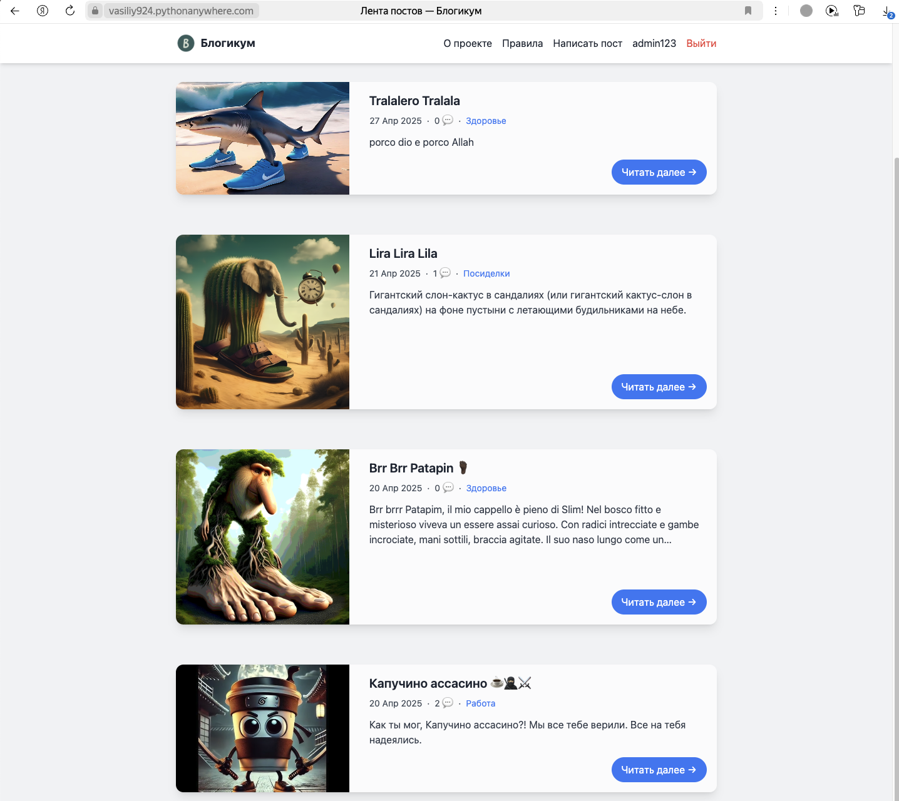

## 📚 Блог-платформа Blogicum

**Blogicum** — это блог-платформа на Django, позволяющая создавать публикации, оставлять комментарии и управлять контентом через удобную админ-панель.

## Описание

Приложение позволяет пользователям регистрироваться, публиковать и редактировать записи (посты) с изображениями, комментировать их, управлять своим профилем. Реализована пагинация, кастомные страницы ошибок, статические страницы, система отложенных публикаций и файловый почтовый бэкенд.

## Технологии

- Python 3.12
- Django 5.1
- SQLite (по умолчанию) или другая база данных
- Bootstrap (для фронтенда, опционально)

## Структура проекта

```
Dev/
└── django-sprint4/
    ├── blogicum/             # Каталог Django-проекта
    │   ├── blog/              # Приложение блогов
    │   ├── core/              # Общие вью и обработчики ошибок
    │   ├── pages/             # CBV для статических страниц (about, rules)
    │   ├── templates/         # HTML-шаблоны
    │   ├── static/            # CSS, изображения
    │   ├── db.sqlite3         # (опционально) БД по умолчанию
    │   └── manage.py          # Скрипт управления проектом
    ├── tests/                 # Тесты Практикума
    ├── venv/                  # Виртуальное окружение
    ├── db.json                # Фикстуры с примерами данных
    ├── requirements.txt       # Зависимости проекта
    ├── pytest.ini             # Конфигурация pytest
    └── setup.cfg              # Настройки flake8, isort и пр.
```

## Установка и запуск

```bash
# Клонируем репозиторий
git clone git@github.com:vasiliy-924/django-sprint4.git
cd Dev/django-sprint4

# Создаём и активируем виртуальное окружение
python -m venv venv
source venv/bin/activate  # Linux/macOS
venv\Scripts\activate    # Windows

# Устанавливаем зависимости
pip install -r requirements.txt

# (Опционально) Загружаем фикстуры
python manage.py loaddata db.json

# (Опционально) Применяем миграции
python manage.py migrate

# Создаем суперпользователя для доступа к админ-панели:
python manage.py createsuperuser

# Запускаем сервер
python manage.py runserver
```

Перейдите в браузере на `http://127.0.0.1:8000/`.

## Реализованные функции

- **Пользователи**: регистрация, вход, выход (Logout через GET), изменение профиля, смена пароля.
- **Посты**: добавление, редактирование, удаление (только автором), отложенные публикации, изображения к постам.
- **Комментарии**: добавление, редактирование и удаление (автором), сортировка по дате (от старых к новым), отображение счёта комментариев.
- **Пагинация**: не более 10 записей на страницах: главная, профиль, категория.
- **Категории/Локации**: создаются только через админку; фильтрация по статусу публикации.
- **Статические страницы**: «О проекте» и «Правила» реализованы через `TemplateView`.
- **Кастомные ошибки**: 403, 404, 500 с собственными шаблонами.
- **Email**: файловый бэкенд собирает письма в `sent_emails/`.



